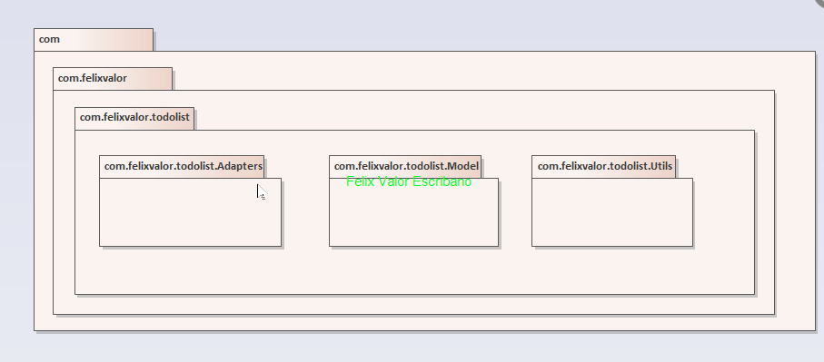
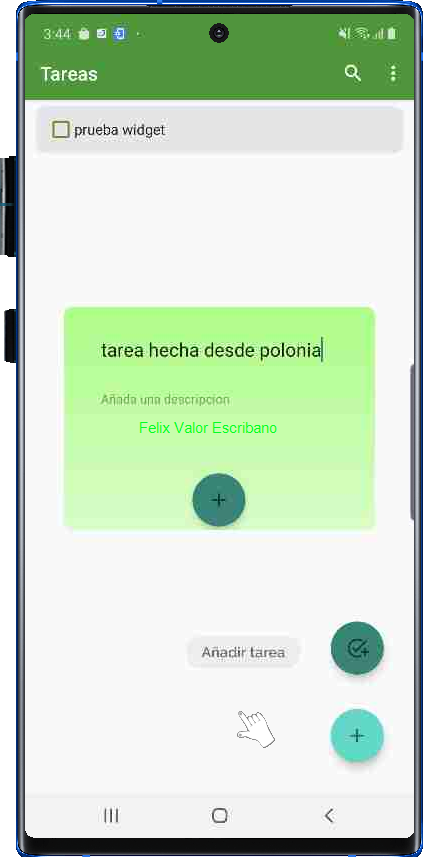

#### CICLO FORMATIVO DE GRADO SUPERIOR

### DESARROLLO DE APLICACIONES MULTIPLATAFORMA

##### PROGRAMACIÓN MULTIMEDIA Y DISPOSITIVOS MÓVILES - 2º CURSO

# [TO DO LIST]

###### Curso: 2021/22

###### AUTOR: [FELIX VALOR ESCRIBANO]

------

# Introducción

## Motivación y objetivos

Me gustaría hacer esta aplicación ya que cuando he querido utilizar una aplicación de tareas ninguna me ofrecía todas las funcionalidades que yo quería tener en una, por lo que me gustaría juntar las ideas que tienen algunas aplicaciones de este estilo y juntarlas todas en una sola aplicación

## Descripción de la aplicación

Esta aplicación nos permitirá listar las tareas que añadamos. Además tendremos un control de usuarios que nos permitirá distinguir de quien son las tareas y pudiendo sincronizar estas entre varios dispositivos 

# Especificación de requisitos

## Requisitos funcionales

El usuario deberá poder hacer lo siguiente en la aplicación:

**Control de acceso:** Nada mas abrir la aplicación debe de haber una pantalla de login para que el usuario inicie sesión con su cuenta, y de no tener, que tenga la posibilidad de registrarse en otra pantalla

**Añadir tareas:** El usuario debe de poder crear tareas en las que escribirá un titulo para ella, y después opcionalmente podrá agregarle una descripción.

**Ver detalles de una tarea y modificarla:** El usuario debe de poder tocar una tarea y poder ver todos los detalles introducidos en esta y modificarla

**Eliminar tareas:** El usuario debe de poder eliminar una tarea o evento de forma permanente

**Buscar tareas:** El usuario podrá buscar mediante una barra de búsqueda una tarea.

Por otra parte el CMS se encargara de sincronizar la base de datos que contenga todos los datos de las tareas con la aplicación

*Esta imagen esta basada en un concepto inicial así que hay algunas funciones que no se han llegado a implementar y al final se han implemtado otras distintas*

## Requisitos no funcionales

Para poder utilizar la aplicación tendremos los siguiente requisitos no funcionales:

- Conexión estable a internet (la aplicación funciona offline pero para sincronizar datos con el cms si necesitaremos conexión)

- Tipos de dispositivos compatibles: Android 7.0 en adelante

- RAM: mínimo 1GB, recomendado 2GB o mas 

- Almacenamiento: 20MB (puede cambiar con siguientes actualizaciones)

## Wireframe (Concepto inicial)

Incluye un boceto y la descripción de cada una de las pantallas de la aplicación

# Análisis Funcional

## Interfaz gráfico

La principal interfaz grafica de añadir tareas es la que muestro en las siguientes 2 capturas, mas adelante se muestran todas las demás funcionalidades con sus respectivas capturas, por lo que he decidido no repetir dichas capturas aquí

## Diagrama de clases

## Diagrama E/R

**User_info**: Esta tabla fue añadida después de hacer el diagrama pero es simplemente una tabla, que guardara un unico campo que contendrá el id del usuario que este con la sesión iniciada. De esta manera sabremos que tareas mostrar. Cuando se cierre sesion se borrara dicho campo para esperar a escribir el del usuario que inicie despues

**Users:** En esta tabla almacenaremos toda la información relacionada con los usuarios

**Task:** En esta tabla se almacenaran las tareas de los usuarios pudiendo identificar y separar los de cada usuario gracias al user_id

A continuación muestro como es una base de datos SQLite de mi aplicación:

## Plan de pruebas 

Tendremos inicialmente un splash donde cargaremos toda la información que nos envié el cms mediante el API REST, una vez pasados los 5 sec del splash determinaremos si había alguien con la sesión iniciada o no, y dependiendo de esto mostraremos el MainActivity o el LoginActivity.

Si entra en el login le daremos la opción a iniciar sesión o a registrarse, si decide registrarse se deberán llenar unos campos obligatorios y después deberá verificar el captcha

Lo primero que comprobaremos en el MainActivity será el buen funcionamiento de  la creación de las tareas, para ello lo primero que haremos será darle al botón de abajo a la derecha y se desplegaran otro dos botón (si le damos otra vez a este botón, desaparecerá el otro botón), cuando le demos a este segundo botón nos saltara un popup que completaremos para la tarea Si dejamos vacío el titulo no deberá añadir nada, de lo contrario se cerrara el formulario y se añadirá una tarea a la pantalla principal. Una vez ahí si le damos a la tarea nos mostrara toda su información. Si le damos al icono de los 3 puntos de arriba a la derecha nos mostrara un pequeño menú con distintas acciones. Si le damos a la barra de búsqueda de la parte superior nos deberá buscar entre todas las tareas, y filtrar para que no se muestre ninguna que no cumpla con la búsqueda.

# Diseño Técnico

## Diagrama de paquetes y estructura del proyecto

A continuación podemos ver el diagrama de paquetes relacionado con nuestro proyecto

Aquí podemos ver como he dividido el proyecto en un paquete en el que guardo el adaptador, otro paquete en el que guardo los modelos, y otro en el que guardo todas las utilidades como base de datos, controlador del chat bluetooth o el proveedor del widget. Las demás clases están en el paquete todolist que engloba todo lo demás

## Arquitectura del sistema

## Entorno de desarrollo, librerías y servicios

En este punto se explicarán las diferentes tecnologías utilizadas para la realización del proyecto, así como los elementos más importantes que permitan entender el funcionamiento del sistema.

Antes de comenzar a comentar las tecnologías utilizadas he de anotar que he conseguido cifrar la base de datos utilizando sqlcipher pero dado que comprometía demasiado la aplicación he dejado comentado el código y he vuelto a una base de datos sin cifrar:

Y aquí podemos ver lo que pasa si abrimos una base de datos cifrada:

A parte de una base de datos cifrada también he utilizado mapas, notificaciones push(con OneSignal), he implementado un chat bluetooth, la posibilidad de contactar mediante correo electrónico o llamadas telefónicas , también he agregado un widget, también he agregado un mensaje Toast que nos avisara de si el dispositivo esta rooteado o no y he implementado un control de usuario con posibilidad de registro para nuevos usuarios con verificación captcha

#### Mapas:

#### Notificaciones push con OneSignal:

#### Chat Bluetooth:

#### Widget: (Anotación importante: para que funcione correctamente debe de haberse iniciado sesión primeramente)

#### Contacto de soporte técnico:

#### Registro de usuarios:

Aquí podemos ver como se ha insertado el usuario pepe en el cms

#### Comprobación de dispositivo rooteado:

#### Búsqueda de tareas:

## Instrucciones para la compilación, ejecución y despliegue de la aplicación

Describe los pasos a seguir para poder compilar el proyecto y ejecutarlo.

Despliegue de la aplicación en Amazon:

## Informe de pruebas

### Pruebas en emuladores y dispositivos reales

Dado que en las capturas anteriores ya se ven pruebas sobre la funcionalidad que tiene mi aplicación aquí procederé a probar la aplicación de manera remota con otros dispositivos que están alojados físicamente en otras partes del mundo:

Aquí podemos ver que utilizare la plataforma de Samsung para probar en varios móviles

Primeramente probare con un Galaxy Note10

Aquí podemos ver como he instalado la aplicación correctamente en el dispositivo móvil

A continuación muestro varias capturas iniciando sesión y creando una tarea:

A continuación muestro como se ve la aplicación en otros dispositivos:

# Conclusiones

## Conocimientos adquiridos

Sin duda he aprendido muchas cosas, como por ejemplo utilizar la api de Google Maps, como hacer un widget, etc... En definitiva muchos conceptos básicos que me ayudaran en un futuro a realizar una aplicación mas compleja. Además he aprendido como funcionan las peticiones GET, POST, PUT y DELETE. También he conocido otras tecnologías que no he podido implementar pero que seguramente si lo haga en el proyecto final como por ejemplo Flutter (Dart) y Firebase

## Mejoras futuras

Me gustaría remodelar la aplicación en un futuro, pero con otras tecnologías como firebase para dejar a un lado el cms y almacenar los datos allí y controlar los usuarios también desde allí.
